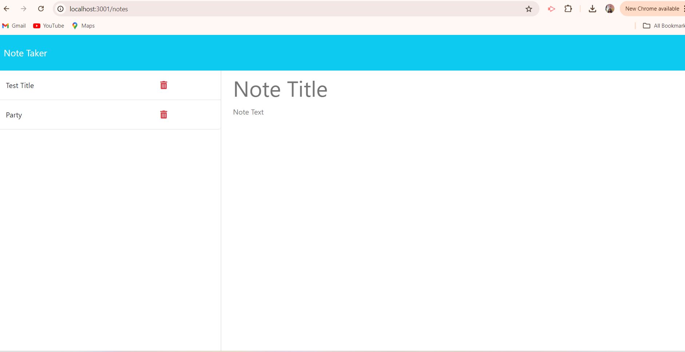
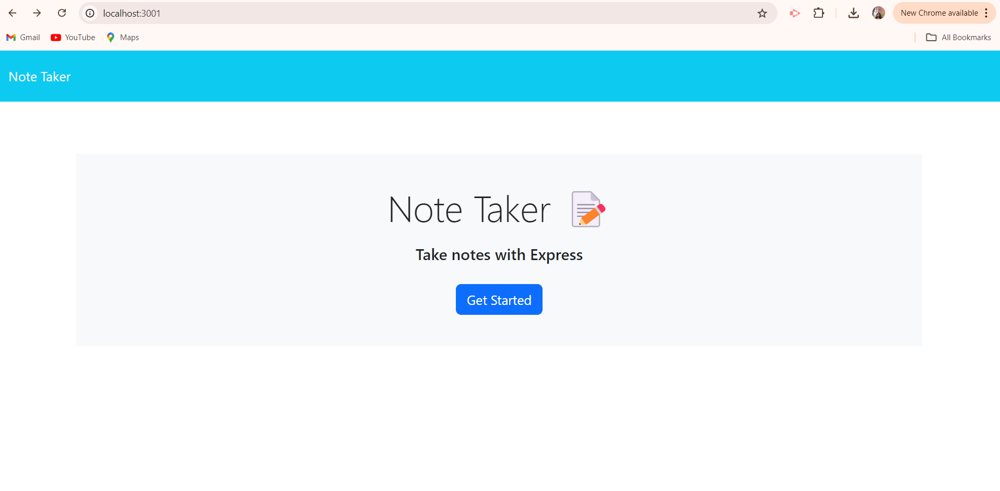
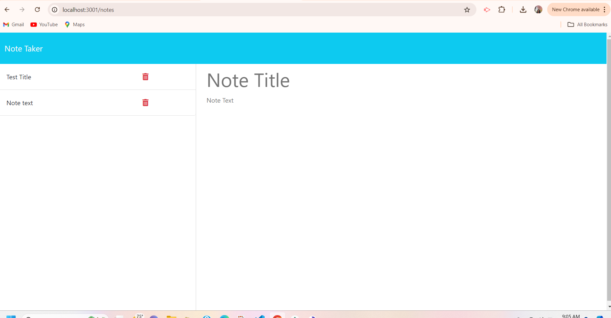
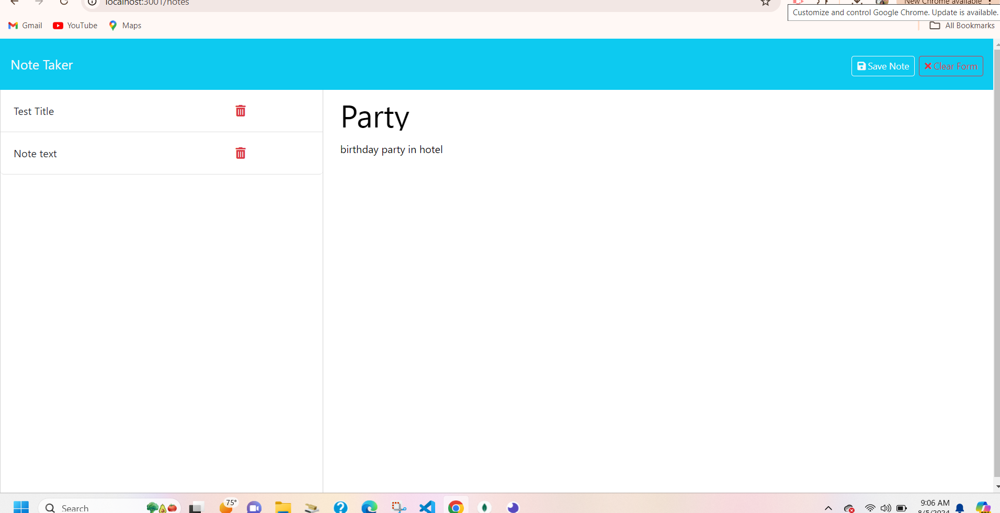
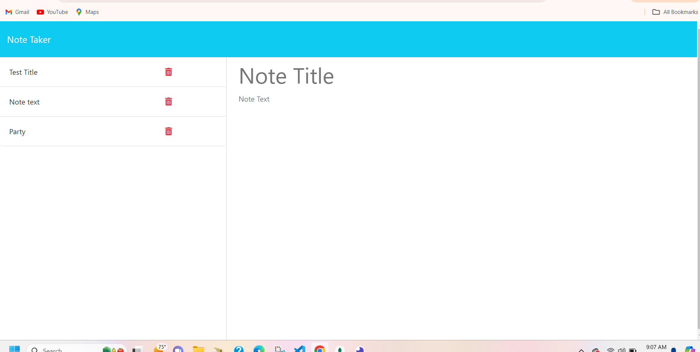

# NoteTracker_challenge11

This is a simple Note Taker application that allows users to create, view, and delete notes. The application uses an Express.js backend to handle API requests and serves static HTML files to the client.

## Table of Contents

- [Installation](#installation)
- [Usage](#usage)
- [API Endpoints](#api-endpoints)
- [Contributing](#contributing)
- [License](#license)

## Installation

1. Clone the repository: in the github
2. install the npm in the bash with the command "npm install"
3. install the uuid
4. starting the server with the command "npm start"

 ## API Endpoints

GET /api/notes
Description: Retrieves all notes.
Response: JSON array of note objects.
POST /api/notes
Description: Creates a new note.
Request Body: JSON object containing title and text properties.
Response: JSON object of the created note.
DELETE /api/notes/
Description: Deletes a note by its id.
Response: JSON object { ok: true } indicating successful deletion.

## Project Structure
note-taker/
├── db/
│   └── db.json
├── public/
│   ├── assets/
│   ├── css/
│   ├── js/
│   ├── index.html
│   └── notes.html
├── routes/
│   ├── apiRoutes.js
│   └── htmlRoutes.js
├── .gitignore
├── package.json
├── README.md
└── server.js

## Contributing 
Fork the repository.
1. created in the main branch
2. Commit your changes:

git commit -m 'Add some feature'
3. Push to the branch:

git push origin feature/your-feature-name
Open a pull request.

## License
This project is licensed under the MIT License. See the LICENSE file for details.

 ## screanshots

1.
2.
3.
4.
5.

